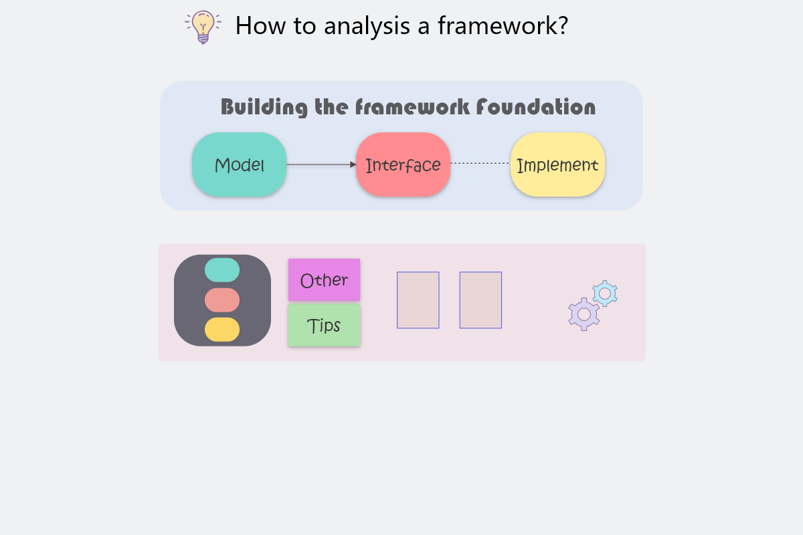

## 分析规范

> ### 框架分析文章结构

- 框架简介
  
  - 前言
  - 核心功能建模
  - 相关生态
  - 性能
  - 总结
  
- 框架所提供的核心接口

  - 容器
  - 服务提供者
  - 数据库
  - AOP
  - 拦截器/中间件

- 框架生命周期分析

  - 开始
  - 事件
  - 结束

- 框架核心组件剥析

  - 缓存
  - 视图
  - 数据库
  - ...

- 框架优雅与杂乱分析

  - 优雅处

  - 其他

    

>### 手写框架

- 前言
- 入口
- 总结

> ### 文章规范

- 图片
- 代码片段
- 标题
- 正文
- 超链接
- 引用
- 推荐阅读

> ### 内容图规范

