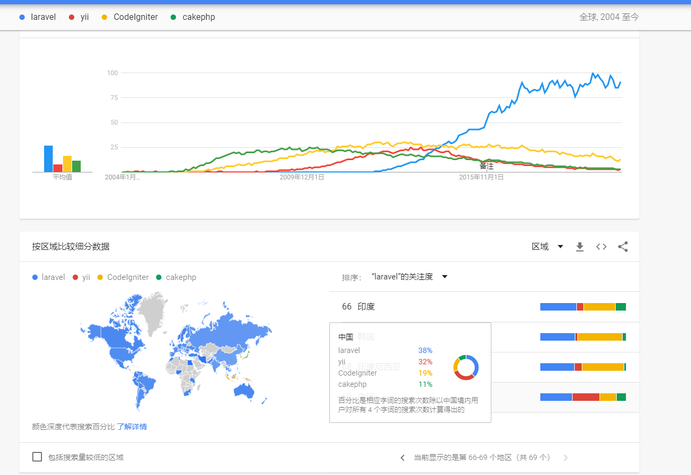
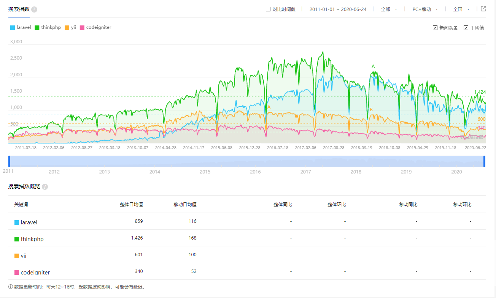

## Laravel框架简介

- 作者: blankqwq
- 邮箱: 1136589038@qq.com

> ##### 前言

​	Laravel框架是当下我使用过诸多php框架中最优雅的一款，其中有大量优秀的设计，能让开发者专注于业务逻辑开发，并在后续研发自己的框架的时学习了诸多优雅的设计。

> ​	 [Laravel](https://laravel.com/) 是 [Taylor Otwell](https://github.com/taylorotwell) 开发的一款基于 PHP 语言的 Web 开源框架，采用了 MVC 的架构模式，在 2011 年 6 月正式发布了首个版本 —— 这是 [Laravel 的第一个 Commit ](https://github.com/laravel/laravel/tree/a188d62105532fcf2a2839309fb71b862d904612)。
>
> 由于 Laravel 具备 Rails(Ruby on Rails) 敏捷开发等优秀特质，深度集成 PHP 强大的扩展包（Composer）生态与 PHP 开发者广大的受众群，让 Laravel 在发布之后的短短几年时间得到了极其迅猛的发展。	——引用自learnku《laravel社区wiki》

​	国内的很多框架也借鉴了laravel中的诸多设计，但是laravel也同样借鉴了其他语言框架中优秀的设计，并逐步衍生出属于自己的特色。

- 版本化方案

	- Laravel 及官方发布的包皆遵循 [语义版本化](https://semver.org/)。主要框架版本每六个月发布一次 (~~2 月和~~ 8 月)，而次要和补丁版本可能每周发布一次。次要版本和补丁 **决不** 包含非兼容性更改。

	- 引入 Laravel 框架或其组件时，应始终使用版本约束，如 `^7.0`，因为 Laravel 的主要版本确实包含非兼容性更改。我们会努力确保您可以在一天或更短的时间内更新到最新版本。

- 支持政策

对于 LTS 版本，例如 Laravel 6，提供了 2 年的错误修复和 3 年的安全修复。这些版本提供了最长的支持和维护窗口。对于一般的发行版本，只提供了 6 个月的错误修复和 1 年的安全修复。对于包括 Lumen 在内的所有其他版本，只有最新版本才会修复错误。此外，请查阅 [Laravel 支持的](https://learnku.com/docs/laravel/7.x/database/7493#introduction) 数据库版本

> ##### 核心功能模型

> ##### 生态

> ##### 性能

> ##### 总结

> 推荐阅读

- [Laravel 中文文档](https://learnku.com/docs/laravel/)

- [Lara vel社区Wiki](https://learnku.com/laravel/wikis)
- [官网](https://laravel.com/)