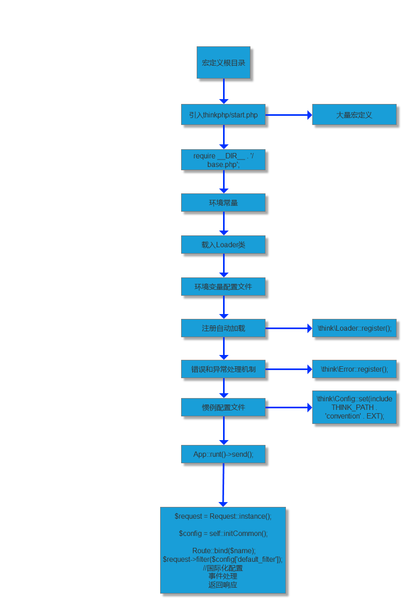

# 简单介绍

> `ThinkPHP`是一个`免费开源的`，`快速`、`简单的`面向对象的``轻量级`PHP开发框架，遵循`Apache2开源`许可协议发布。

> `V5.0版本`目前进入BUG及安全维护阶段，不再进行功能升级！（BUG修正截止时间为2019年1月1日 安全更新截止间2020年1月1日）

> tp 5.1

    tp5.1变化很大
    引入容器和Facade支持
    依赖注入完善和支持更多场景
    重构的（对象化）路由
    支持注解路由
    跨域请求支持
    配置和路由目录独立
    取消系统常量
    助手函数增强
    类库别名机制
    模型和数据库增强
    验证类增强
    模板引擎改进
    支持PSR-3日志规范
    中间件支持（V5.1.6+）
    支持Swoole/Workerman运行（V5.1.18+）

### 优点

###  缺点

### 文件引入流程

