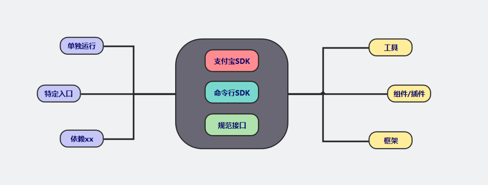
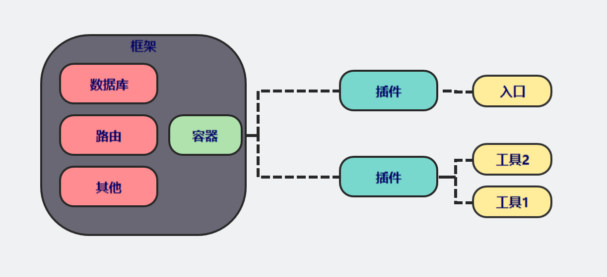
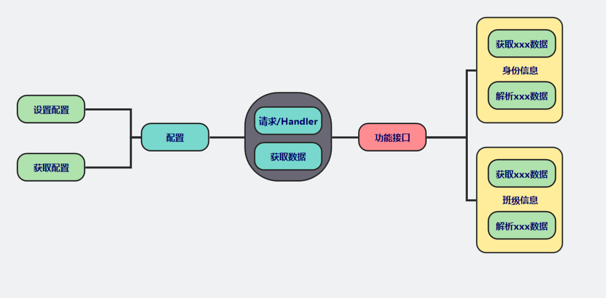
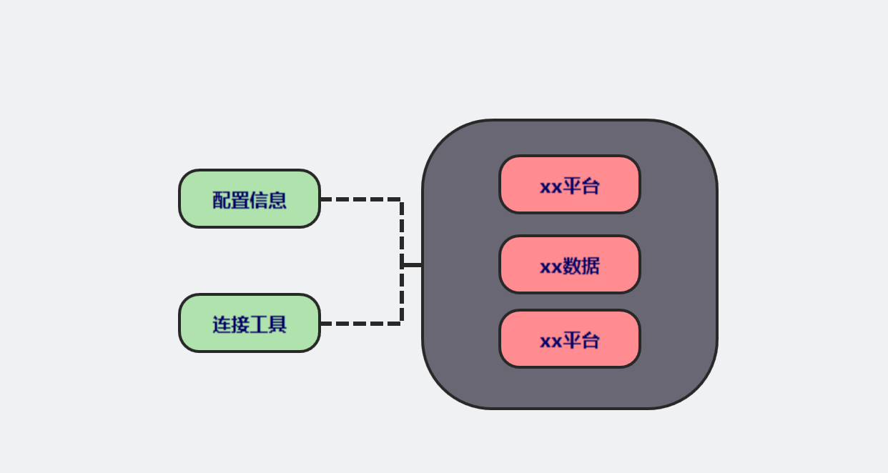
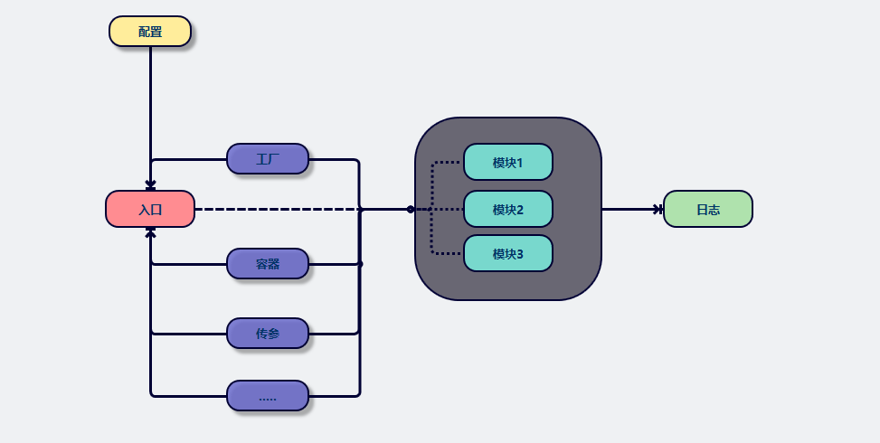
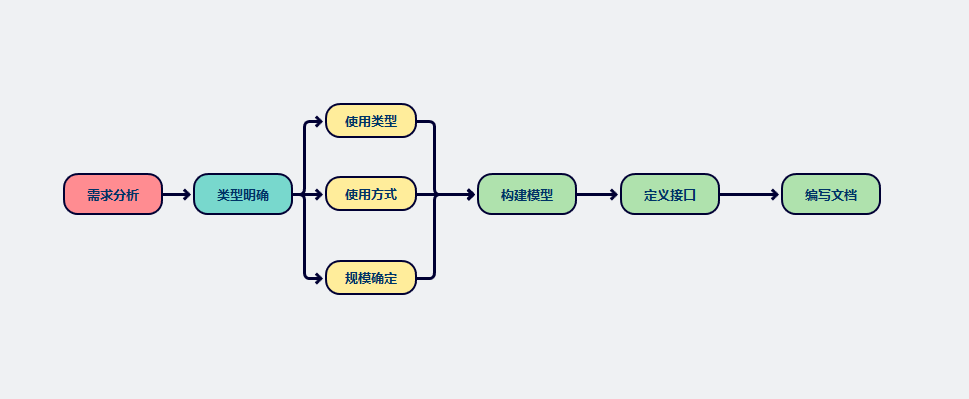
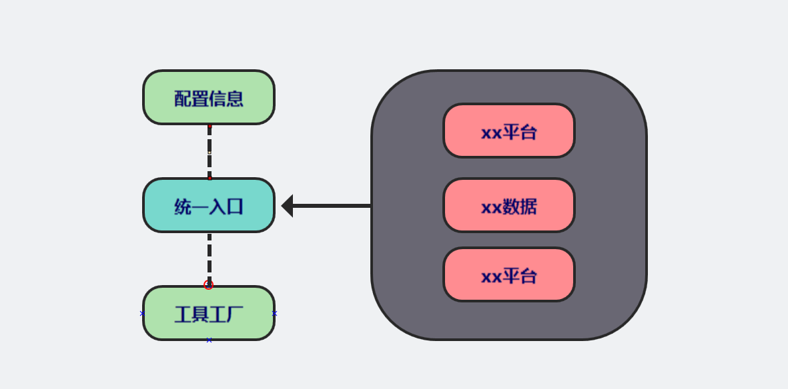
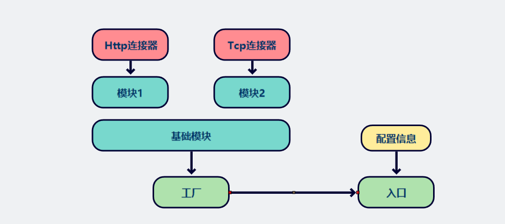

## 如何构建一个优雅扩展

- 作者: blankqwq
- 时间: 20200630

> ### SDK 是什么

SDK是对基础程序库(函数库)的一种封装，又称之为`软件开发工具包`。

这种阐述过于泛化，我们将范围缩小到`扩展`这个概念

SDK是一种`DSL(Domain Specific Language)`领域特定语言，对某需求的使用性阐述可运行语言，实际上也就是将某种扩展性需求用代码的方式阐述出来

> ### SDK 的类型



根据不同的应用场景可以分为一下几种类型：

- `应用上划分
  - 对接类型：将要对接的某些接口封装起来，例如`easywechart`,`pay`
  - 功能类型：实现某类系统/特殊功能的调用`guzzleHttp`
  - 规范类型：为某些服务提供对于扩展的规范，大部分为接口,`psr/log`
  - 工具包类型: 封装某些常用的方法
  - 插件类型：为某些框架提供额外功能/优化功能,`jqhph/laravel-wherehasin`,`laravel-admin的插件`
- 规模上划分
  - 工具类型：模型较为单一，没有太多的模型进行复合，例如`ml`,`factoryCode`,`supports`
  - 组件类型：多个模型组合所形成的扩展,提供某功能的一整套/完整的解决方案 例如`symphony-console`的多种组件,`laravel-s`,`pay`,`easywechart`,`laravel-pay`,`mybaits`
  - 框架类型: 多种组件的组合,已经脱离了我们的sdk范围,`laravel/framework`,`thinphp/framework`,`blankphp/framework`
- 使用上划分
  - 独立运行：每个子模块都可以单独运行
  - 统一入口：通过特定模块使用入口进行执行(通常通过工厂模式等)
  - 抽象类型：将内容抽象化，一个类可以完成所有功能(通常同功能的外部链接: 数据库操作)
  - 组合类型：依赖其他组件(在框架中)才可运行
- DSL类型上划分(其实和使用方式相似)
  - 内部DSL，用宿主语言实现，例如`psr`
  - 外部DSL，自己设计的调用方式，例如`easywechart`

将SDK抽象成一个完善功能的类。

- 在功能上，有明确的界限划分。
- 在设计上，五大原则。

------

> ### 基础模型

- 插件类型



- 成为框架中的一部分(热插拔)
  - 将实例对象注入框架中，获取配置等方式可以与框架内部方法相互结合
  - 无需自建工厂
  - 组件工具类型，可能是多个扩展组合，通常具有完整的某一类功能，并提供相应的其他组件

- 对接SDK模型



核心是获取数据，但是需要传入配置数组，后期有新的信息接口需要对接 可以实现接口/继承父类，并提供良好的语义调用。

- 功能类型

- 独立运行



每个工具都可以单独使用,只需要传递需要的参数即可，这样既可以提供非常语义化和明了话的参数，又可以减少前期开发成本。

调用方式如下:

```
//我们需要统一调用方式，抽象出接口
Tencent::getInfo($appKey,$name)
Aliyun::getInfo($appKey,$name)

Tencent::parseManage()
Aliyun::parseManage()

$tencent = new Tencent()
$tencent->getInfo();
$aliyun = new Aliyun();
$aliyun->getInfo();
....
```

- 统一入口



统一入口执行，可以减少对象的创建，将内容集中化管理

一般使用组合的方式体现出多态

调用方式如下:

```
$tools = new XxxTool($config);
$tools->tencent()->get();
$tools->aliyun()->get();


$tools->tencent->get();
$tools->aliyun->get();
```

------

> ### 案例分析

下面将以一个实例来说明sdk建模与分析的过程



> 开发SDK第一步，准确划分类型和具体规模

需求：从指定接口获取我们想要的数据

- 类型分析
  - 根据主要需求，获取xxx系统接口的数据，且无需对框架进行适配，说明组要是对接类型。
  - 从当前规模上划分，该sdk目前属于工具类型,模型单一只有获取数据接口,无需额外提供日志/特殊服务

> ##### 根据类型合理建模



语义化能力较弱，但是扩展性和可维护性高，封装程度高，对于其他开发者来说使用不需要在意内部逻辑即可以进行使用。

> 开始设计



- 我们的需求具有以下几种隐藏需求：
  - 方便扩展
    - 只需要增加模块和对应方法即可
  - 简单易用
    - 传入配置信息就可以快速使用，并对ide提示有良好支持
  - 封装程度高
    - 基类完成大部分复杂逻辑，模块只提供简单的获取数据的方式
  - 优雅的错误提示
- 接口和实现定义
  - 入口
  - 配置
  - 实例化工厂
  - 具体功能模块
  - 规模可能会随着后续的增大而增大，只需要增加连接器和模块即可

> `php`代码示例(其他语言扩展正在更新中)

工厂

```
class Factory{
    
    private $tools;
    private $clients = [];
    private $config;
    private const CLIENT_NAME = 'client';
    private const DEFAULT_CLIENT = Client::class;

    /**
     * ToolsFactory constructor.
     * 工厂类 生产tool
     * @param $config
     */
    public function __construct($config)
    {
        $this->config = $config;
    }

    /**
     * @param $name
     * @param array $option
     * @return mixed|void
     * @throws \ReflectionException
     * 生产工具
     */
    public function make($name, $option)
    {
        $key = $this->getKey($name, $option);
        return $this->tools[$key] ?? $this->tools[$key] = $this->build($name, $option);
    }

    /**
     * @param $clientClass
     * @param $options
     * @return Client|mixed
     * 生产连接工具
     */
    public function createClient($clientClass, $options)
    {
        if (class_exists($clientClass)) {
            // 返回
            if (empty($options)) {
                $options = $this->getDefaultClientOptions($clientClass);
            }
            $key = $this->getKey($clientClass, $options);
            return $this->clients[$key] ?? $this->clients[$key] = new $clientClass($options);
        }
    }

 
    /**
     * @param $name
     * @param $option
     * @return string
     * 根据配置和模块名生成对应key，在对象中查找是否存在
     */
    public function getKey($name, array $option): string
    {
        return md5($name . json_encode($option));
    }

    /**
     * @param $className
     * @param $option
     * @return mixed
     * @throws \ReflectionException
     */
    public function build($className, $option): BaseTool
    {
        if (!class_exists($className)) {
            $className = sprintf('TestingToolsSdk\Tools\%s', ucfirst($className));
        }
        [$clientClass, $parameters] = $this->getClient($className);
        $parameters = $this->getFromConfig($parameters);
        return new $className($this->createClient($clientClass, $option), ...$parameters);
    }


    /**
     * @param $className
     * @return array
     * @throws \ReflectionException
     * 获取所需要的连接器
     */
    public function getClient($className): array
    {
        $reflection = new \ReflectionClass($className);
        $constructor = $reflection->getConstructor();
        $client = self::DEFAULT_CLIENT;
        $parameters = [];
        if ($constructor->isPublic()) {
            $res = $constructor->getParameters();
            foreach ($res as $item) {
                if ($item->getName() === self::CLIENT_NAME && $item->getClass()) {
                    $client = $item->getClass()->getName();
                } else {
                    $parameters[] = $item->getName();
                }
            }
        }
        return [$client, $parameters];
    }
}
```

入口

```
class Index{
    
    /**
     * @var string
     * 版本
     */
    private static $version = '0.1.0-dev';

    /***
     * @var self
     */
    private static $instance;

    /***
     * @var ToolsFactory
     */
    private $factory;

    /**
     * @var array
     */
    private $config = [
        'appKey' => "",
        'http' => [
            'base_uri' => 'http://testing-tools-webapp.mingchao.com/',
            'timeout' => 10.0
        ],
    ];

    /**
     * TestingToolsSdk constructor.
     * @param array $config
     */
    public function __construct($config = [])
    {
        $this->setConfig($config);
        $this->createFactory();
    }

    private function createFactory(): void
    {
        $className = $this->config['factory'] ?? ToolsFactory::class;
        $this->factory = new $className($this->config);
    }


    /**
     * @return TestingTools
     */
    private static function getInstance(): TestingTools
    {
        return self::$instance ?: self::$instance = new self();
    }

    /**
     * @return string
     */
    private function getVersion(): string
    {
        return self::$version;
    }

    private function setConfig($config = []): TestingTools
    {
        if (!empty($config)) {
            $this->config = array_merge($this->config,$config);
        }
        return $this;
    }

    private function callTools($name, $option = [])
    {
        return $this->factory->make($name, $option);
    }

    /**
     * @param $name
     * @return mixed
     */
    public function __get($name)
    {
        return $this->callTools($name);
    }

    public function __call($name, $arguments)
    {
        return $this->callTools($name, ...$arguments);
    }
}
```

基类

```
class Tools{
     protected $auth = true;
    protected $client;
    protected $appKey;
    public $successCodeRange = [200, 300];

    public function __construct(Client $client, $appKey)
    {
        $this->client = $client;
        $this->appKey = $appKey;
    }

    /**
     * @param $url
     * @param $method
     * @param $data
     * @return Result
     * @throws HttpClientErrorException
     */
    private function request($url, $data, $method = 'get'): Result
    {
        /** @var ResponseInterface $res */
        $res = $this->getClient()->{$method}($url, $data);
        $result = [
            'headers' => $res->getHeaders(),
            'uri' => $url,
            'method' => $method,
            'statusCode' => $res->getStatusCode(),
            'data' => $res->getBody()->getContents(),
        ];
        if (!$this->checkSuccess($res->getStatusCode())) {
            // 抛出异常
            $data['successRange'] = $this->successCodeRange;
            throw new HttpClientErrorException('Status Code not in successRange', $result);
        }
        return new Result($result);
    }

    /**
     * @param $url
     * @param $data
     * @return Result
     * @throws HttpClientErrorException
     */
    public function get($url, $data): Result
    {
        return $this->request($url, ['query' => $this->buildData($data)], 'get');
    }


    /**
     * @param $code
     * @return bool
     */
    public function checkSuccess($code): bool
    {
        [$start, $stop] = $this->successCodeRange;
        return $code >= $start && $code < $stop;
    }

    /**
     * @return Client
     */
    protected function getClient(): Client
    {
        return $this->client;
    }

    /**
     * @param $data
     * @return array
     */
    public function buildData($data): array
    {
        if (!isset($data['appKey']) && $this->auth) {
            $data['appKey'] = $this->appKey;
        }
        return array_filter($data);
    }

    /**
     * 简单版本
     * @param $data
     * @param $rules
     * @return array
     * @throws \Exception
     */
    public function validParameter($data,$rules): array
    {
        $validate = new Valid($rules);
        return $validate->valid($data);
    }
}
```

> 目录结构

```
|---src
    |--- Tools              模块
    |--- Libs               工具
    |--- Contracts          契约
    |--- Exceptions         异常
    |--- XXXFactory.php     工厂
    |--- Index.php          入口
```

> 开发

> 测试

> 文档编写

- 目录
- 项目介绍
  - 重要依赖(环境版本,要求等)
  - 项目维护、CI、依赖更新状态（如果有）
  - 快速开始
  - 安装
  - 使用
  - 贡献指南
  - 许可(License)
  - 联系方式
  - 鸣谢
  - 最佳实践 [Best-README-Template](https://github.com/othneildrew/Best-README-Template)
- 项目简介及创作动机
- features & 适用人群
- 根据规模提供不同的文档类型
- 版本支持Supported Versions
- 其它特有的信息

#### 例如

```
//todo
```

> ### Tag规范

| 示例    | 命名类型                                                     |
| ------- | ------------------------------------------------------------ |
| v1.0.01 | 1,主版本号：当你做了不兼容的 API 修改， 0,次版本号：当你做了向下兼容的功能性新增， 01,修订号：当你做了向下兼容的问题修正。 |

> ### 测试

单元测试

- 性能优化
- 找出逻辑错误
- 确保模块可以正常运行，结果正确

集成测试

测试覆盖率

> ### 其他

> ### 碰到的问题

1. 分类和规划比较纠结，前期的优化比较多，所以导致后续时间延误
2. 对于

> ### 总结

### 推荐阅读

[手把手教你如何构建一个优秀的开源项目](https://learnku.com/articles/5265/how-to-build-an-open-source-project-that-breaks-thousands-of-star)

[一步步带你开发 Laravel 5.5 扩展包（实战教程）](https://learnku.com/laravel/t/7791/step-by-step-with-you-to-develop-the-laravel-55-extension-package-real-war-tutorial)

[pds/skeleton PHP 扩展架构规范（扩展开发必读）](https://learnku.com/laravel/t/9875/pdsskeleton-php-extension-architecture-specification-extended-development-required)