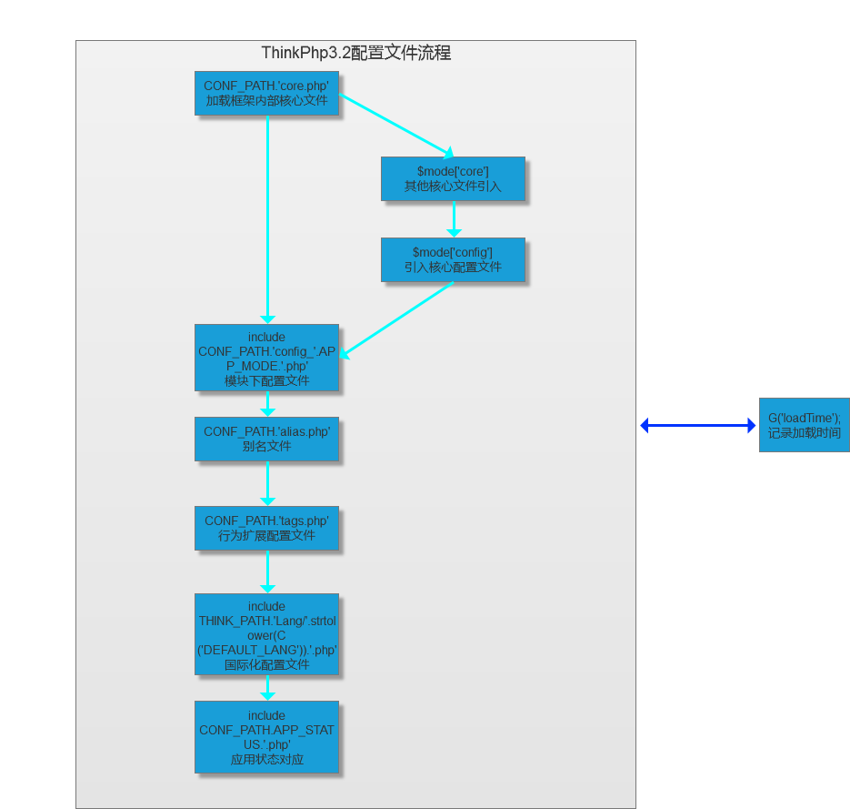

# 配置文件载入流程



> debug开启状态会`编译`文件，然后`缓存`[放入一个文件减少IO] ――compile函数


```
1. APP_PATH.'Common/Conf/core.php'

    或者 ''
    
    MODE_PATH.APP_MODE.'.php' =>  Mode/common.php  
    
    [或者其他api/sae]
             |
            \/
    a.数组 core 中核心文件[App ... 等等]
    b.数组config
         // 系统惯例配置
        ThinkPHP/Conf/convention.php       
        // 应用公共配置
        CONF_PATH.'config.php'

    //默认common
    是没有core数组，但是其他环境[sae/api]下存在

    
2.CONF_PATH.'config_'.APP_MODE.'.php'
    => 用户访问模块下config_common.php

3.读取alias.php [当前应用下的Conf目录]

4.引入tags配置的类[读取当前应用下的Conf目录]
    
5.引入语言文件
    => ThinkPHP/Lang

6.当前应用状态对应的配置文件
    =>CONF_PATH.APP_STATUS.'.php'
    
7.引入创建目录结构文件
    =>ThinkPHP/Common/build.php
    
```

> 缓存配置文件减少IO

```
//缓存加载的文件内容
$content  .=  "\nnamespace { Think\Think::addMap(".var_export(self::$_map,true).");";

$content  .=  "\nL(".var_export(L(),true).");\nC(".var_export(C(),true).');Think\Hook::import('.var_export(Hook::get(),true).');}';

Storage::put($runtimefile,strip_whitespace('<?php '.$content));

```


