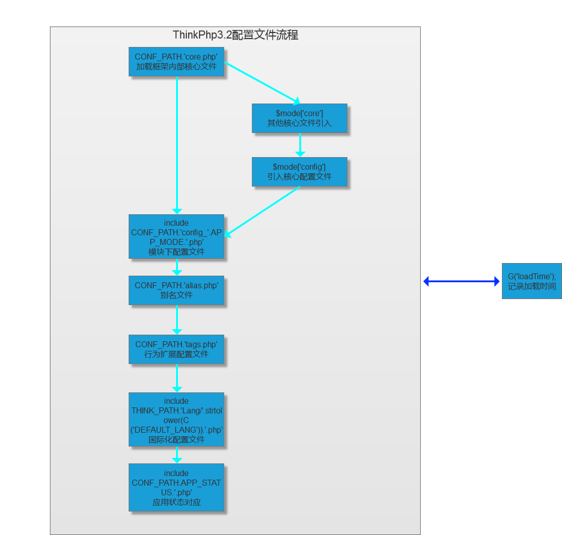

## Dispatcher

> 路由分发者

    App:init中进入Dispatcher::dispatch()
    
    主要从用户访问的路径中结合自身的路由解析模式
    
    分析出用户访问的模块(Model)以及动作(Action)
    
    再引入该模块下的一些主要配置文件
    
    再进入App:exec()中返回运行结果
    

> dispatch运行流程图




## 代码解析

```php

// 配置文件ThinkPHP/Conf/convention.php   


//兼容模式PATHINFO获取变量例如 ?s=/module/action/id/1 后面的参数取决于URL_PATHINFO_DEPR

url解析以及路由功能
        
```


## Dispatcher

> 内部函数分解

```php
static private function getController($var) {
    $controller = (!empty($_GET[$var])? $_GET[$var]:C('DEFAULT_CONTROLLER'));
    unset($_GET[$var]);
    if($maps = C('URL_CONTROLLER_MAP')) {
        if(isset($maps[strtolower($controller)])) {
            // 记录当前别名       define('CONTROLLER_ALIAS',strtolower($controller));
            // 获取实际的控制器名
            return   ucfirst($maps[CONTROLLER_ALIAS]);
        }elseif(array_search(strtolower($controller),$maps)){
            // 禁止访问原始控制器
            return   '';
        }
    }

    if(C('URL_CASE_INSENSITIVE')) {
        // URL地址不区分大小写
        // 智能识别方式 user_type 识别到 UserTypeController 控制器
        $controller = parse_name($controller,1);
    }
    return strip_tags(ucfirst($controller));
}


/**
 * 获得实际的操作名称
 * @access private
 * @return string
 */
static private function getAction($var) {
    $action   = !empty($_POST[$var]) ?
        $_POST[$var] :
        (!empty($_GET[$var])?$_GET[$var]:C('DEFAULT_ACTION'));
    unset($_POST[$var],$_GET[$var]);
    if($maps = C('URL_ACTION_MAP')) {
        if(isset($maps[strtolower(CONTROLLER_NAME)])) {
            $maps =  $maps[strtolower(CONTROLLER_NAME)];
            if(isset($maps[strtolower($action)])) {
                // 记录当前别名
                define('ACTION_ALIAS',strtolower($action));
                // 获取实际的操作名
                if(is_array($maps[ACTION_ALIAS])){
                    parse_str($maps[ACTION_ALIAS][1],$vars);
                    $_GET   =   array_merge($_GET,$vars);
                    return $maps[ACTION_ALIAS][0];
                }else{
                    return $maps[ACTION_ALIAS];
                }
                
            }elseif(array_search(strtolower($action),$maps)){
                // 禁止访问原始操作
                return   '';
            }
        }
    }        
    return strip_tags(strtolower($action));
}


/**
 * 获得实际的模块名称
 * @access private
 * @return string
 */
static private function getModule($var) {
    $module   = (!empty($_GET[$var])?$_GET[$var]:C('DEFAULT_MODULE'));
    unset($_GET[$var]);
    if($maps = C('URL_MODULE_MAP')) {
        if(isset($maps[strtolower($module)])) {
            // 记录当前别名
            define('MODULE_ALIAS',strtolower($module));
            // 获取实际的模块名
            return   ucfirst($maps[MODULE_ALIAS]);
        }elseif(array_search(strtolower($module),$maps)){
            // 禁止访问原始模块
            return   '';
        }
    }
    return strip_tags(ucfirst(strtolower($module)));
} 
    
```