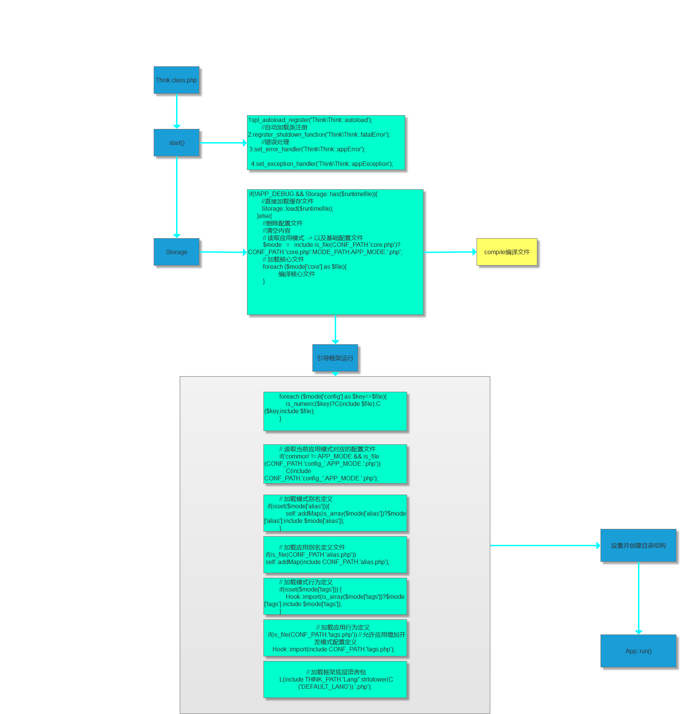

# think 3.2 文件逐层进入
    让我们一起进入thinkphp的设计方式
    
    看看3.2性能为什么那么强大[仅仅一部分]
            - 路由等非常迅速
            - 但是遇到数据库操作[关联关系n+1问题]

    有什么可取之处
    又有什么需要避免的地方
    
    
    优点：
        tp3.2与ssh非常相似
        所以采用java的开发思路去开发tp是非常舒服的
        
        
        还有诸多可以优化的地方  
        -->     1.优化框架n+1问题
        -->     2.解决一些其他耗时性能问题
        使得框架更有利于快速开发
        
        本次实践
        发现虽然很多轮子都需要手动找或者自己做
            但是,解决了一些很久以前没使用过的底层问题
        
        注重过程
    
    缺点：
    
        但是tp3.2 我认为性能并不是特别的强势
        [很多地方仍然可以优化]

    
##  入口文件

> `index.php` 定义一些基础->引入引导文件

```
// 开启调试模式 建议开发阶段开启 部署阶段注释或者设为false
define('APP_DEBUG',True);
//默认模块
define('BIND_MODULE','Home');
//应用目录
define('APP_PATH','./Application/');
//引入核心文件
require "./ThinkPHP/ThinkPHP.php";
```


## 引导运行文件

>  `ThinkPHP.php`入口文件解析 

```
// 记录开始运行时间

$GLOBALS['_beginTime'] = microtime(TRUE);


if(!IS_CLI) {

    // 当前文件名

    if(!defined('_PHP_FILE_')) {

        if(IS_CGI) {

            //CGI/FASTCGI模式下

            $_temp  = explode('.php',$_SERVER['PHP_SELF']);

            define('_PHP_FILE_',    rtrim(str_replace($_SERVER['HTTP_HOST'],'',$_temp[0].'.php'),'/'));

        }else {

            define('_PHP_FILE_',    rtrim($_SERVER['SCRIPT_NAME'],'/'));

        }

    }

    if(!defined('__ROOT__')) {
        $_root  =   rtrim(dirname(_PHP_FILE_),'/');
        define('__ROOT__',  (($_root=='/' || $_root=='\\')?'':$_root));
    }

}
// 加载核心Think类  
// CORE_PATH ==> Library/Think/Think.vlass.php
require CORE_PATH.'Think'.EXT;
//开始引导运行
Think\Think::start();
```


## Think 核心类


> Think.class.php 引导结构




## 性能缺点分析
    todo

## 解耦合
     todo

